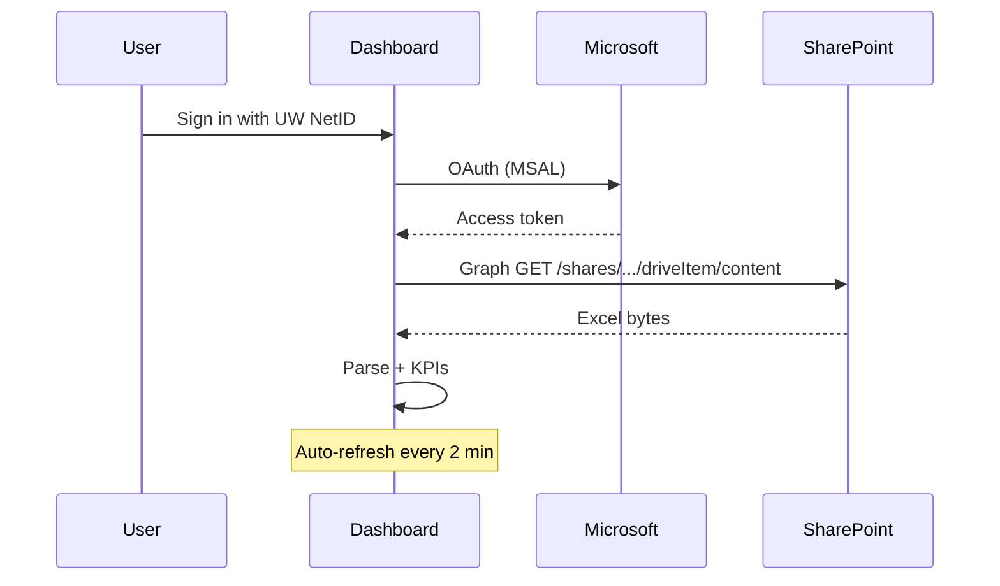

# UW NetID sign-in + live SharePoint Excel

Yes — **UW Microsoft sign-in solves the SharePoint access problem** for users who already have permission to open the tracker. After sign-in, the dashboard downloads the workbook via **Microsoft Graph** and refreshes every 2 minutes (configurable).

This is **near real-time**, not instant: Excel must be saved to SharePoint before Graph sees the update.

## One-time setup (MSTI admin / IT)

### 1. Register an app in Azure

1. Go to [Azure Portal → App registrations](https://portal.azure.com/#view/Microsoft_AAD_RegisteredApps/ApplicationsListBlade) (sign in with UW account).
2. **New registration**
   - Name: `MSTI Coffee Chat Dashboard`
   - Supported account types: **Accounts in this organizational directory only** (UW) — or single tenant if you have the tenant ID
   - Redirect URI: **Single-page application (SPA)** → `http://localhost:5173` (add production URL later, e.g. `https://your-app.vercel.app`)
3. Copy **Application (client) ID** → put in `.env.local` as `VITE_AZURE_CLIENT_ID`

### 2. API permissions (delegated)

Under **API permissions → Add permission → Microsoft Graph → Delegated**:

| Permission | Why |
|------------|-----|
| `User.Read` | Show signed-in name |
| `Files.Read` | Read the Excel file |
| `Sites.Read.All` | Access SharePoint-hosted files |

Click **Grant admin consent** if your tenant requires it (UW IT may need to approve).

### 3. Local env file

```bash
cp .env.example .env.local
# Edit .env.local with your Client ID
```

Restart:

```bash
npm run dev
```

### 4. SharePoint file access

Each user who signs in must **already be able to open** the tracker link in the browser. Graph uses that user’s permissions — sign-in does not bypass SharePoint sharing rules.

## How it works



## Production deployment

Add your production origin to **Authentication → Redirect URIs** in the Azure app (SPA platform).

Set the same env vars in your host (Vercel, Netlify, etc.).

## Troubleshooting

| Issue | Fix |
|-------|-----|
| "Authentication not configured" | Set `VITE_AZURE_CLIENT_ID` in `.env.local` |
| Access denied after login | User needs SharePoint access to the workbook |
| Admin consent required | UW IT grants consent for Graph permissions |
| Popup blocked | Allow popups for localhost / your domain |
| Still shows offline copy | Graph failed; check error banner; verify share link |

## Fallback without Azure

If Azure setup is not ready, export CSV to `public/data/tracker.csv` and use the manual sync flow in [SHAREPOINT.md](./SHAREPOINT.md). Auth gate will send users to login until Client ID is configured.
